---           
layout: post
title: Armbar from mount
comments: false
tags: jujutsu, armbar
---

Source: [Draculino: Arm Bar from Mount Position](https://www.youtube.com/watch?v=5uuU0LfsZOY)

# Jujutsu Armbar from mount

### 01 - posició inicial
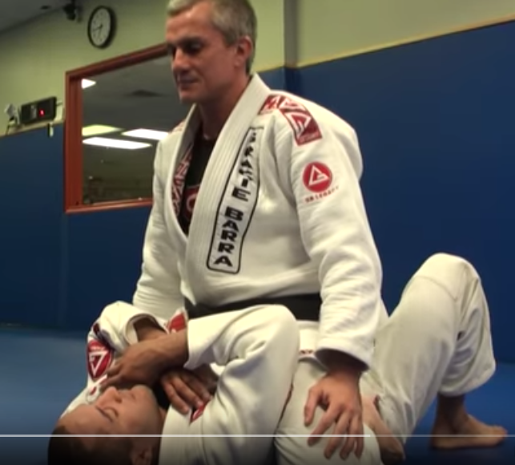

### 02 - collar de banda contraria a ma de dalt de uke
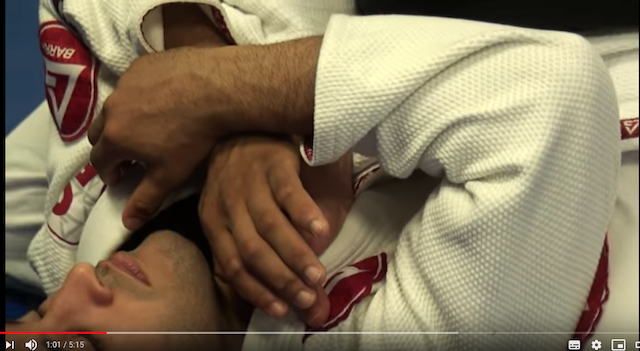

### 03 - espitjam colçe cap enfora i apoyam panxa 
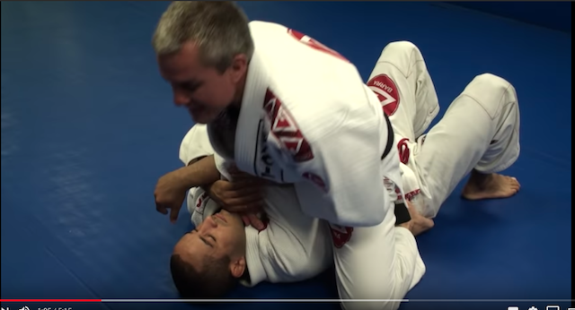

### 04 - apoyam ma enterra i ens feim cap amunt
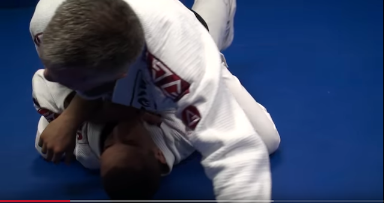

### 05 - altra vista
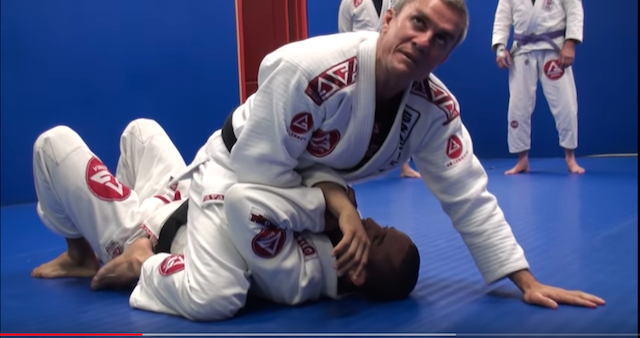

### 06 - genoll esquerra a orella
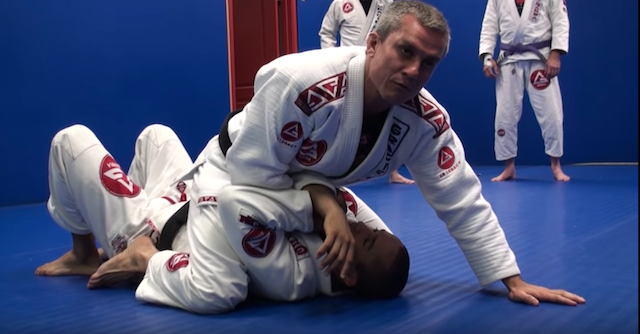

### 07 - agafam colçe contrari

### 08 - ens apoyam sobre genoll i passam a X-mount. Notar que peu està baix hombre. Notar que tenim es cul quasi fora per poder passar sa cama

### 09 - treim es peu i posam a uke de costat. Passam braç per baix des seu
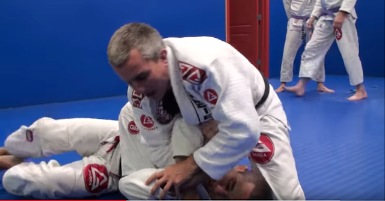

### 10 - mos apoyam amb uke per passar s altra cama
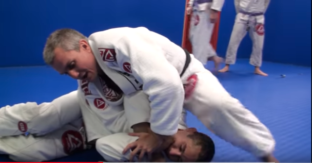

### 11 - inici de armbar
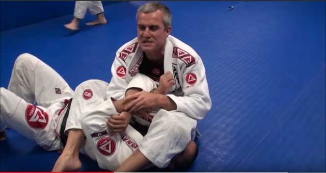

### 12 - passam peu de la cara per baix
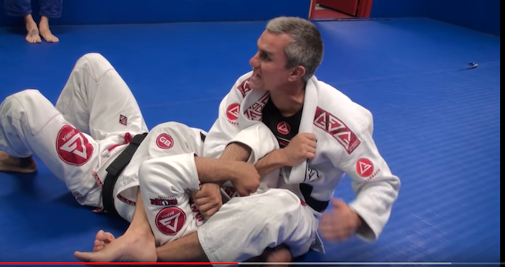

### 13 - agafam canell ma del braç que tenim trincat

### 14 - duim braç baix canell

### 15 - tornam a obrir cames i apyam ma
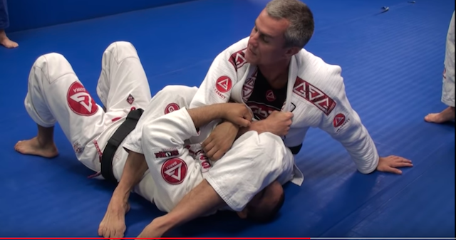

### 16 - aquesta vegada podem agafar be el canell
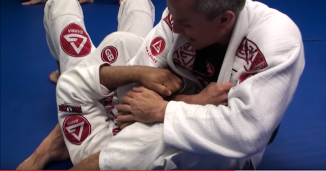

### 17 - Estiram cap amunt, fent palanca sobre canell
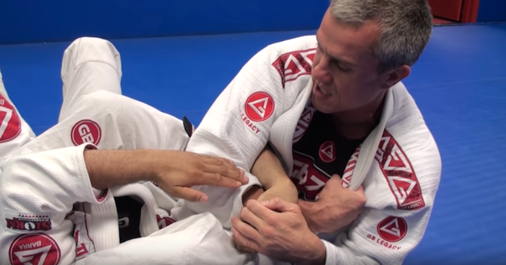

### 18 - arm bar
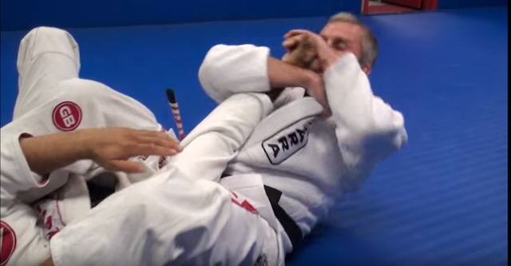

### 19 - posició final
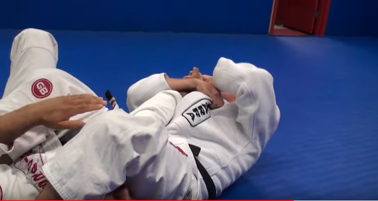

### 20 - detall de com dur es peus cap endins per controlar hombre o de uke

### 21 - detall de com alinear antebraç amb canell de uke

### 22 - detall de com apretar amb el genoll cap amunt per augmentar la palanca
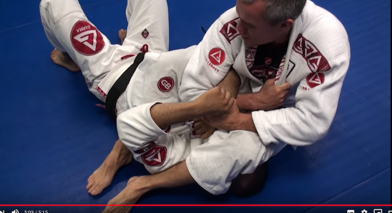
